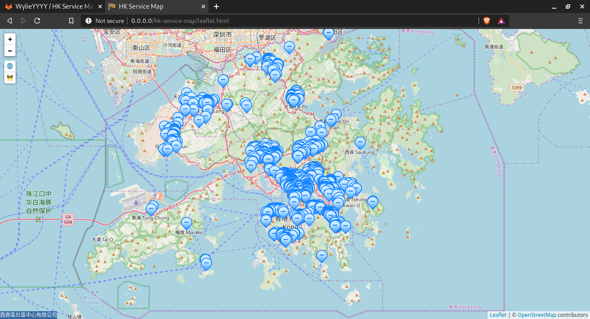
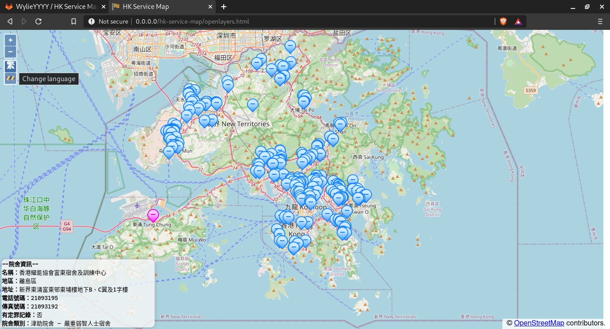
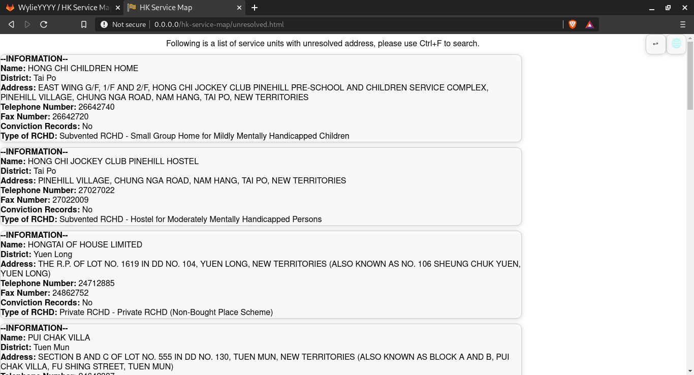

# HK Service Map
HK Service Map is a map to visualise service units data from XML provided by the Hong Kong Social Welfare Department.
#### Screenshot
Map screen including hover status bar in bottom-left with Leaflet.js.  
  
Displaying detailed info in traditional Chinese with OpenLayers, change language by clicking the button with globe icon.  
  
Page with a list of unresolved address, navigated to by clicking the fence icon under the globe icon in map screen.  
  

### Features:
- Implementation in both OpenLayers and Leaflet.js;
- Can be run locally or with a web server;
- No API limit (Address lookup service by HK-OGCIO, map tiles by OSM, layering API by OpenLayers or Leaflet.js);
- Multilingual support (Additional language and field support can be added through editing `scripts/localise.js`);
- Address correction with `override.txt`;

### Setup
1. Download the source code here.
2. Install `python3` and `pip` from repositories or build from source.
3. Using `pip`, install `grequests` and `xmljson`
4. Connect to the internet and run `getinfo.py` using `python3` (Heavy Internet traffic process)
5. Wait for the script to finish and open either `openlayers.html` or `leaflet.html` depends on the preferred API.

### Tested URL
[Basic Information and Service Quality Information of Residential Care Homes for the Elderly](https://elderlyinfo.swd.gov.hk/sites/ltc-swd/files/rche_rsp_list.xml)  
[Basic Information and Service Quality Information of Residential Care Homes for Persons with Disabilities](https://rchdinfo.swd.gov.hk/sites/rchd-swd/files/rchd_rsp_list.xml)
### XML Template
Target XML must follow this template for this map to work, `<ANY/>` means two node with any tag can be placed here. `count` attribute in tag means the tag can be repeated by `count` times, otherwise only once is allowed, other attributes are mandatory. `[abc here]` means insert the custom value denoted by `abc`. Tags can contain any attributes.
```
<ANY>
	<serviceUnits>
		<serviceUnit count="Infinity">
			<nameTChinese/>
			<addressEnglish/>
			<addressTChinese/>
			<districtEnglish/>
			<ANY count="Infinity"/>
		</serviceUnit>
	</serviceUnits>
</ANY>
```
With `ANY` tag in `serviceUnit`, `scripts/localise.js` must be changed in order to display localised names, if no entry is added to the file, XML tag name will be parsed and displayed. If empty string is used in localised names, the associated property is skipped from displaying.

### Use Case of override.txt
`override.txt` is a tab separated value file of the following format, no empty lines are allowed:
```
[Traditional Chinese Name]	[Proposed Address]	[Longtitude Offset]	[Latitude Offset]	[Registered Address]
```
The file can be use either for replacing incorrect coordinates from address query or locating unresolved units with nearby landmark.  
It regenerates automatically if removed, and add units with unresolved address to the file.  
After changing `override.txt`, `getinfo.py` needs to be rerun.  
`[Traditional Chinese Name]` is used to identify the unit to modify.  
`[Proposed Address]` is the target approximated address to query for the unit, can be in any language that is recognised by HK-OGCIO API. If it is the string `[NO OVERRIDE]`, the entry will be ignored.  
`[Longitude Offset]` is the longitude offset from the `[Proposed Address]`.  
`[Latitude Offset]` is the latitude offset from the `[Proposed Address]`.  
`[Registered Address]` is only for reference when the file is generated, and can be omitted.  

Entries should not contain any lowercase letter before the first tab, as they are treated as comments and will be ignored.

#### Comments
Comments in `override.txt` can disregard the tab separated value format, but it must have at least one lowercase character before a tab character.  
Comments should not be all lowercase snakecase as they are reserved as option key (e.g. `xml_url`).  
Allowed comment examples: `This`, `with space`, `This with space`, `Mixed_snakecase`, `lower	UPPER`  
Disallowed comment examples: `this`, `snake_case`, `UPPERCASE`, `UPPER_SNAKECASE`, `!@#$%^&*12345`, `UPPER	lower`
