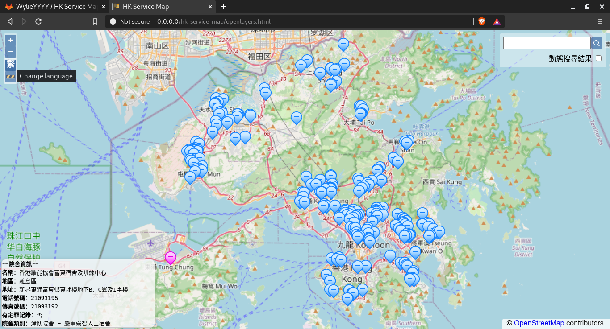

# HK Service Map
HK Service Map is a map to visualise service units data from XML provided by the Hong Kong Social Welfare Department.
#### Screenshot
Map screen including hover status bar in bottom-left with Leaflet.js.  
  
Displaying detailed info with a different locale with OpenLayers, change by clicking the button with globe icon.  
  
Page with a list of unresolved address, navigated to by clicking the fence icon under the globe icon in map screen.  
  

### Features:
- Implementation in both OpenLayers and Leaflet.js;
- Can be run locally or with a web server;
- No API limit (Address lookup service by HK-OGCIO, map tiles by OSM, layering API by OpenLayers or Leaflet.js);
- Multilingual support (Additional language and field support can be added through editing `scripts/localise.js`);

### Setup
1. Download the source code here.
2. Install `python3` and `pip` from repositories or build from source.
3. Using `pip`, install `grequests` and `xmljson`
4. Connect to the internet and run `getinfo.py` using `python3` (Heavy Internet traffic process)
5. Wait for the script to finish and open either `openlayers.html` or `leaflet.html` depends on the preferred API.

### Tested URL
[Basic Information and Service Quality Information of Residential Care Homes for the Elderly](https://elderlyinfo.swd.gov.hk/sites/ltc-swd/files/rche_rsp_list.xml)  
[Basic Information and Service Quality Information of Residential Care Homes for Persons with Disabilities](https://rchdinfo.swd.gov.hk/sites/rchd-swd/files/rchd_rsp_list.xml)

### XML Template
Target XML must follow this template for this map to work, `<ANY/>` means two node with any tag can be placed here. `count` attribute in tag means the tag can be repeated by `count` times, otherwise only once is allowed, other attributes are mandatory. `[abc here]` means insert the custom value denoted by `abc`
```
<ANY xmlns="[XML hostname here]">
	<serviceUnits>
		<serviceUnit count="Infinity">
			<addressEnglish/>
			<districtEnglish/>
			<ANY count="Infinity"/>
		</serviceUnit>
	</serviceUnits>
</ANY>
```
With `ANY` tag in `serviceUnit`, `scripts/localise.js` must be changed in order to display additional tags' names.